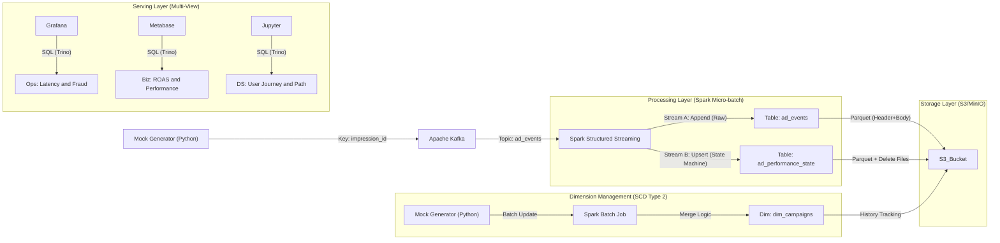

---

# Design Doc: Real-time AdTech Attribution Engine & Lakehouse

## 1. Overview

### 1.1 Objective

Build a high-performance **Real-time Attribution Engine** utilizing **Kafka**, **Apache Spark Structured Streaming**, **Apache Iceberg**, **Trino**, **Metabase**, and **Grafana**.

The system is designed to simulate a production-grade AdTech environment. The primary focus is to demonstrate **high-efficiency stateful processing** by handling complex attribution logic (Impressions -> Clicks -> Conversions) with minimal latency, even under constrained infrastructure resources.

### 1.2 Core Goals & SLA

* **Throughput Efficiency:** Benchmarked at **5,000+ events/sec** on a resource-constrained single node (8GB RAM Docker). This demonstrates high processing efficiency and low serialization overhead.
* **Data Freshness:** < 60 seconds end-to-end latency for Gold Layer (ROAS Dashboard).
* **Consistency:** Strict **Exactly-Once** processing via Idempotent writes; ensuring no revenue over-counting.
* **Resilience:** "Time Machine" architecture allowing full historical replay from Bronze Layer.

## 2. Architecture

### 2.1 High-Level Data Flow



## 3. Component Design

### 3.1 Ingestion Layer: Stateful Mock Generator

* **Source:** Python-based Event Generator.
* **Logic:** Simulates a probabilistic funnel: `IMPRESSION` (Base) -> `CLICK` (5% prob, delayed) -> `CONVERSION` (10% prob, delayed).
* **Kafka Strategy:**
* **Topic:** `ad_events`
* **Key:** `impression_id` (Ensures all events for a single ad lifecycle land in the same partition, minimizing Spark shuffle).
* **Value:** JSON Payload.


**Event Schema (JSON):**

```json
{
  "event_id": "evt-uuid-v4",
  "event_type": "CLICK", 
  "event_timestamp": 1706600050,
  "impression_id": "imp-20260127-abc-123",  // Correlation Key
  "campaign_id": "camp-summer-sale-01",
  "user_id": "u-device-hash-123",
  "geo_country": "US",
  "platform": "IOS",
  "bid_price": 1.50,         // Cost (Present in Impression)
  "conversion_value": 0.0,   // Revenue (Present in Conversion)
  "meta_pixels": { ... }     // Extra details
}

```

### 3.2 Storage Layer: Medallion Architecture (Dual-Stream)

The system utilizes a **Parallel Write** pattern to serve two distinct needs: **Immutable History** and **Mutable State**.

#### **Layer 1: Bronze - `lakehouse.bronze.ad_events` (The Time Machine)**

* **Pattern:** Append-Only Log (Transaction Fact).
* **Schema Strategy:** **Header + Body**.
* *Header:* Parsed columns (`impression_id`, `event_time`, `event_type`) for partition pruning.
* *Body:* `raw_payload` (String) to preserve full fidelity for schema evolution and disaster recovery.


* **Partitioning:** `hours(event_timestamp)`
* **Use Cases:** Replay/Backfill, ML Training (CTR Models), Fraud Analysis, User Journey Analysis.

#### **Layer 2: Gold - `lakehouse.gold.ad_performance_state` (The State Machine)**

* **Pattern:** Accumulating Snapshot Fact Table (Merge-on-Read).
* **Role:** The "Single Source of Truth" for current campaign performance.
* **Logic:** Uses `MERGE INTO` to consolidate separate events into a single row per impression.
* *Impression:* Inserts row, sets `cost`.
* *Click:* Updates row, sets `is_clicked = true`.
* *Conversion:* Updates row, sets `is_converted = true`, sets `revenue`.


* **Partitioning:** `bucket(16, impression_id)` (Optimized for UUID lookups).

### 3.2.1 Attribution MVP (design-time rules)
* **Attribution model:** Last Click only; view-through not counted in MVP.
* **Click lookback:** 7 days (fixed; store in config table).
* **Watermark vs lateness:** Watermark for state cleanup/dedup = `6h`; business late threshold = `1h`. Late events can still be eligible if within 7-day window.
* **Dedup key:** `event_id` as the global idempotency key; replays do not double-count.
* **Eligibility logic:** 
  * If `conversion_ts - click_ts <= 7d` and not duplicate → `eligible=true`, update Gold.
  * If beyond 7d → `eligible=false`; accumulate into `revenue_out_of_window`, keep main metrics unchanged.
  * Late but still within window → update, also mark `is_late=true` / `late_by_ms`.
* **Multiple conversions per impression:** Keep only the first eligible conversion; subsequent ones are marked ineligible and routed to audit fields.
* **Audit/invalid path:** Missing keys, negative values, out-of-window, or duplicate events go to an audit table/columns for traceability.
* **Dashboard source of truth:** BI/OPS read only from Gold (post-eligibility); Silver/Bronze are for exploration and recompute.

### 3.2.2 Gold Fact Schema (MVP)
`lakehouse.gold.ad_performance_state`

| Column | Type | Purpose |
| --- | --- | --- |
| `impression_id` | STRING | PK; single impression lifecycle |
| `campaign_id` | STRING | Aggregation FK |
| `creative_id` | STRING | Aggregation FK |
| `user_id` | STRING | Reach & dedup across users |
| `geo_country` | STRING | Dimension |
| `platform` | STRING | Dimension |
| `is_clicked` | BOOLEAN | Has an eligible click |
| `is_converted` | BOOLEAN | Has an eligible conversion |
| `impression_time` | TIMESTAMP | First impression time |
| `click_time` | TIMESTAMP | Last eligible click time |
| `conversion_time` | TIMESTAMP | First eligible conversion time |
| `cost` | DOUBLE | Bid/cost from impression |
| `revenue` | DOUBLE | Revenue from first eligible conversion |
| `eligible` | BOOLEAN | Passed business window & dedup |
| `is_late` | BOOLEAN | Arrived later than 1h tolerance |
| `late_by_ms` | BIGINT | Lateness in ms (for audit) |
| `revenue_out_of_window` | DOUBLE | Revenue from ineligible/late conversions |
| `last_updated_ts` | TIMESTAMP | Last write timestamp |

> Partitioning: keep `bucket(16, impression_id)`; if most queries group by campaign/time, consider an additional date partition or materialized rollups.

### 3.3 Data Modeling (Star Schema)

The Gold Layer serves as the Fact table, enriched by Dimension tables for analytics.

| Table Type | Table Name | Key Columns | Purpose |
| --- | --- | --- | --- |
| **Fact** | `gold.ad_performance_state` | `impression_id`, `is_clicked`, `revenue` | Core State Machine for attribution. |
| **Dimension** | `dims.dim_campaigns` | `campaign_id`, `budget_type` | Campaign metadata analysis. |
| **Dimension** | `dims.dim_users` | `user_id`, `demographics` | Audience analysis. |

### 3.4 Dimension Management: SCD Type 2 Strategy

To ensure **Point-in-Time Correctness** for financial reporting (e.g., analyzing historical performance against the *actual* budget set at that time), we implement **SCD Type 2 (Slowly Changing Dimensions)** for the `dim_campaigns` table.

* **Objective:** Track changes in Campaign Budget and Status over time without losing history.
* **Implementation:** Iceberg `MERGE` operation is used to close out old records and insert new active records atomically.
* **Schema Design (`lakehouse.dims.dim_campaigns`):**

| Column Name | Type | Description |
| --- | --- | --- |
| `campaign_key` | `LONG` | **Surrogate Key**. Unique ID for specific version of a campaign. |
| `campaign_id` | `STRING` | **Natural Key**. The ID used in source systems. |
| `budget_amount` | `DOUBLE` | The budget value *during this specific time window*. |
| `status` | `STRING` | ACTIVE / PAUSED. |
| `start_ts` | `TIMESTAMP` | **Validity Start**. |
| `end_ts` | `TIMESTAMP` | **Validity End** (High watermark `9999-12-31` for current). |
| `is_current` | `BOOLEAN` | Flag for fast filtering of current state. |

* **Query Pattern (Time-Travel Join):**
Unlike standard joins, the Fact table joins the Dimension table using the event timestamp to match the correct dimension version.
```sql
SELECT 
    f.impression_id, 
    d.budget_amount as budget_at_time_of_impression
FROM gold.ad_performance_state f
JOIN dims.dim_campaigns d 
  ON f.campaign_id = d.campaign_id 
  AND f.impression_time >= d.start_ts 
  AND f.impression_time < d.end_ts

```
---

## 4. Key Metrics Strategy

We implement a **Tri-Fold Analytics Strategy** to separate Business, Behavioral, and Operational concerns.

### 4.1 Business Intelligence (Metabase) - Source: Gold Layer

**Target Audience:** PMs, Analysts, Advertisers.

| Metric | Logic | Business Value |
| --- | --- | --- |
| **ROAS** (Return on Ad Spend) | `SUM(revenue) / SUM(cost)` | Profitability measurement. |
| **CTR** (Click-Through Rate) | `AVG(is_clicked)` | Creative effectiveness. |
| **CVR** (Conversion Rate) | `SUM(is_converted) / SUM(is_clicked)` | Landing page effectiveness. |
| **Attribution Lag** | `AVG(conversion_time - impression_time)` | Lookback window optimization. |

### 4.2 Behavioral Analytics (Ad-Hoc SQL/Notebooks) - Source: Bronze Layer

**Target Audience:** Data Scientists.

| Metric | Logic | Business Question Answered |
| --- | --- | --- |
| **Effective Frequency** | `COUNT(Impression) WHERE time < conversion` | "How many ads should we show before it becomes annoying/wasteful?" |
| **Path Analysis** | `collect_list(event_type) ORDER BY time` | "Do users convert after seeing a Video ad followed by a Banner?" (Multi-touch Attribution) |
| **Unique Reach** | `COUNT(DISTINCT user_id)` | "How many actual humans did we reach vs just impression count?" |

### 4.3 System & Trust Ops (Grafana) - Source: System Metrics & Bronze Layer

**Target Audience:** Data Engineers, Security Team.

| Metric | Logic | Operational Value |
| --- | --- | --- |
| **End-to-End Latency** | `now() - max(event_timestamp)` | SLA Monitoring. |
| **Kafka Consumer Lag** | `LogEndOffset - CurrentOffset` | Backpressure monitoring. |

---

## 5. Technical Challenges & Solutions

### 5.1 The "Small File" Problem

* **Issue:** Streaming ingestion generates tiny Parquet files every 10-30 seconds, degrading read performance.
* **Solution:** Automated **Compaction Job**.
* Bronze: Rewrite small files into 128MB files (ZSTD compressed).
* Gold: Merge "Position Delete" files into Data files to speed up MoR reads.

### 5.2 Out-of-Order Data

* **Issue:** A "Conversion" event might arrive before the "Impression" is fully committed due to network lag.
* **Solution:** Spark Structured Streaming handles the micro-batching, while **Iceberg's ACID MERGE operation** guarantees correct state updates regardless of event arrival order.

### 5.3 Schema Evolution

* **Issue:** Upstream teams add new tracking parameters without notice.
* **Solution:** The **Bronze Layer "Raw Payload"** column captures strictly typed new fields as a JSON string, allowing downstream parsers to extract them via SQL without breaking the ingestion pipeline.

---

## 6. Run Commands

### Start the Infrastructure

```bash
make up
# or: docker-compose up -d

```

### 1. Generate Traffic (Mock Ad Events)

This script simulates user behavior (Impressions -> Clicks -> Conversions) with realistic delays.

```bash
docker exec -it lakehouse-spark python src/producers/ad_traffic_generator.py

```

### 2. Start the Attribution Engine

Launches the Spark Structured Streaming job with dual-write logic (Append Bronze / Upsert Gold).

```bash
docker exec -it lakehouse-spark spark-submit src/jobs/attribution_streaming_job.py

```

### 3. Access Dashboards

* **Metabase (BI):** http://localhost:3030
* **Grafana (Ops):** http://localhost:3000
* **MinIO (Storage):** http://localhost:9001
