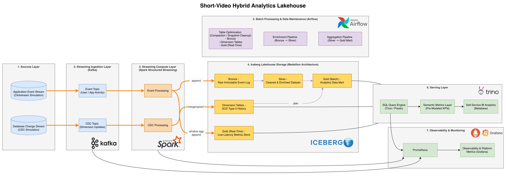

# Short Video Hybrid Analytics Lakehouse 🚀


> **A production-grade data platform simulating large-scale viral analytics.**  
> Engineered to balance sub-minute operational monitoring ("The Pulse") with high-precision strategic analysis ("The Diagnosis").

---

## 🎯 Project Objectives

Traditional ETL pipelines often struggle to serve both **Real-time Ops** (e.g., "Which video is going viral *right now*?") and **Historical Strategy** (e.g., "User retention over 30 days") without maintaining two separate codebases. This project implements a **Hybrid (Lambda) Architecture** to bridge this gap.

### Business Goals
1.  **Detect Viral Trends Instantly:** Calculate "Viral Velocity" in < 3 minutes to boost high-potential content.
2.  **Monitor Ecosystem Health:** Track "Cold Start" success for new creators and "Doomscrolling" rates for user retention.
3.  **Ensure Data Reliability:** Self-healing pipelines that handle schema drift and late-arriving data.

---

## 🏗 System Architecture

**High-Level Data Flow:**



The platform uses **Apache Iceberg** as the unified storage layer, supporting a "Polyglot Persistence" strategy:
*   **Hot Path (Streaming):** Ingests events into **Append-Only** tables for low-latency monitoring.
*   **Cold Path (Batch):** Processes history via **Medallion Architecture** (Bronze → Silver → Gold) for deep strategic analysis.

---

## 📚 Design & Engineering Deep Dive

Detailed architectural decisions and trade-offs are documented below:

| Component | Focus Area | Link |
| :--- | :--- | :--- |
| **Pipeline Architecture** | Hybrid Lambda Architecture, SLA definitions, and Compaction strategies. | 📄 [Read Doc](design_doc/PipelineArchitecture.md) |
| **Data Model** | Medallion Architecture (Bronze/Silver/Gold), Star Schema, and SCD Type 2 handling. | 📄 [Read Doc](design_doc/DataModel_SchemaDesign.md) |
| **Dashboard & Metrics** | Business logic for "Viral Velocity", "Doomscroll Rate", and Trino Serving layer. | 📄 [Read Doc](design_doc/Dashboard.md) |
| **Chaos Engineering** | Simulating "Viral Spikes", "Broken Clients", and traffic generation logic. | 📄 [Read Doc](design_doc/MockEventGenerator.md) |

---

## 🔧 Key Engineering Highlights

### 1. Solving the "Small File Problem"
Streaming ingestion often degrades read performance by creating thousands of tiny files. I implemented an **Hourly Bin-packing Strategy** that rewrites these into optimal-sized Parquet files without blocking reads.

### 2. Hybrid Write Strategy
*   **Gold Layer (Facts):** Uses **Append-Only** to handle high-throughput scenarios (designed for 10k+ events/sec) without the overhead of Upserts.
*   **Dimension Layer:** Uses **Merge-on-Read** to ensure strict consistency for mutable user profiles.

### 3. Semantic Layer Decoupling
Business logic is decoupled from physical storage using **Trino Views**. This allows metric definitions (e.g., "What is a Viral Video?") to evolve without requiring expensive data backfills.

---

## 🛠 Tech Stack

*   **Ingestion:** Apache Kafka, Debezium
*   **Compute:** Apache Spark (Structured Streaming & Batch)
*   **Storage:** Apache Iceberg (MinIO/S3)
*   **Serving:** Trino (PrestoSQL)
*   **Orchestration:** Apache Airflow
*   **Observability:** Grafana, Prometheus

---

## 🚀 How to Run

1.  **Start Infrastructure:**
    ```bash
    docker-compose up -d
    ```
2.  **Initialize Lakehouse Tables:**
    ```bash
    docker exec -it lakehouse-spark spark-submit /home/iceberg/local/src/spark/init_schema.py
    ```
3.  **Start Data Generator (Simulate Traffic):**
    ```bash
    # Simulate traffic (Default: 1000 events/sec, adjustable for local hardware)
    python src/generator/mock_transaction_kafka_producer.py
    ```
4.  **Access Dashboards:**
    *   **Trino UI:** `http://localhost:8081`
    *   **Metabase:** `http://localhost:3030`
    *   **MinIO Console:** `http://localhost:9001`


---