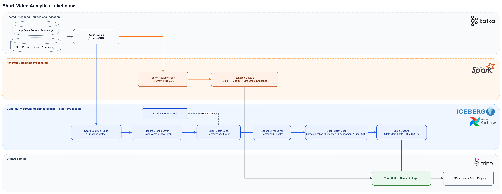

# Real-time Transactional Data Lakehouse


Contract-driven realtime decisioning for short-video operations.  
This README is intentionally aligned to `docs/` contracts (source of truth for scope, KPI, and governance).

## Business Problem

Short-video operations need decision-ready signals quickly after upload to:

1. Amplify high-potential, high-quality videos.
2. Flag high-momentum but risky/low-quality videos for review.
3. Rescue high-quality new uploads that are under-exposed.

Without a governed decision product, actions are delayed, inconsistent, and hard to audit.

## Project Goal (Milestone 1)

Deliver a realtime decisioning vertical slice that emits actionable `BOOST`, `REVIEW`, and `RESCUE` recommendations within latency and quality constraints.

Delivery path:

`content_events -> Kafka -> Spark RT -> Iceberg RT fact -> Trino semantic views -> Metabase operations dashboard (health metrics + recommendation preview)`

## Decision Consumers and Cadence

1. `Content Ops`: consume `BOOST` candidates every minute.
2. `Trust & Safety Ops`: consume `REVIEW` actions every minute.
3. `Creator Ops`: consume `RESCUE` actions every 5 minutes.

## Expected Business Impact

1. Reduce time-to-distribution for high-potential content via faster `BOOST` decisions.
2. Reduce unsafe amplification by routing risky high-momentum content to `REVIEW` earlier.
3. Improve creator-side fairness by rescuing high-quality but under-exposed new uploads.
4. Reduce decision variance across ops teams with one governed realtime decision-preview interface.

## Business Impact Model (KPI Tree)

North star:

`Decision-ready quality at low latency`

Driver KPIs (M1 targets):

1. `Decision Latency (P95) < 3 minutes`
2. `Boost Precision (simulation-backed) >= 0.75`
3. `Rescue Success Rate (simulation-backed) >= 0.70`

Guardrails:

1. Realtime freshness breaches trigger degraded-status handling and manual review.
2. RT vs T+1 reconciliation error stays within thresholds:
   - count p95 `<= 0.08`
   - rate p95 absolute diff `<= 0.03`
3. False Suppression Rate (simulation-backed) target `<= 0.10`.

## High-Level Architecture



```text
content_events + cdc.content.videos
        -> Kafka contracts
        -> Spark Structured Streaming
        -> Iceberg tables (bronze / dims / gold)
        -> Trino semantic serving
        -> Metabase operations dashboard (health metrics + recommendation preview)
```

## Action Queue Scope (M3 Reference)

1. Operational action-queue execution is deferred to M3 and is out of M1 scope.
2. M3 queue scope and lifecycle reference:
   - `docs/architecture/realtime-decisioning/m3-action-queue-reference.md`

## Reliability Controls

1. SLA target: event-to-preview freshness latency `P95 < 3 minutes`.
2. Freshness response:
   - freshness `P95 > 3m` for 5 minutes: mark serving status as degraded and require manual review before operational use
   - freshness `> 10m` or ingestion outage: mark serving status as stale and block sign-off until healthy again
3. Recovery requires 15 consecutive healthy minutes.
4. Late-event impact is tracked via watermark/drop counters and reconciliation metrics.
5. Rule rollout guard:
   - `WARN`: manual review required before promoting new `rule_version`
   - `CRIT`: block promotion until reconciliation returns to PASS
   - automated blocking workflow is deferred to M3

## Scope Boundaries (M1)

In scope:

1. Realtime decisioning for `BOOST`, `REVIEW`, `RESCUE`
2. Trino semantic serving views and Metabase operations dashboard (health metrics + recommendation preview)
3. Global RT vs T+1 reconciliation baseline
4. Rule version traceability and freshness-response observability

Out of scope:

1. Full batch decision system expansion
2. Segment-level reconciliation beyond global baseline
3. Automated policy optimization loop in production
4. Operational `rt_action_queue` execution and queue-consumer automation (deferred to M3)

## Milestone Acceptance Definition

M1 is considered successful when:

1. Semantic serving views, health metrics, and recommendation preview are generated and queryable on 1-minute cadence.
2. Decision preview logic matches metric and policy contracts.
3. Serving contract constraints hold (grain uniqueness, required fields, valid decision preview domain, rule-version traceability).
4. Freshness and degraded-mode behavior meet streaming and serving contracts.
5. Recommendations are deterministic and auditable with explicit `rule_version` and threshold context.

## Documentation Map (Source of Truth)

1. [Docs Overview](docs/README.md)
2. [Business Decision PRD & KPI Tree (M1)](docs/product/business-decision-prd-kpi-tree.md)
3. [Realtime Decisioning Contracts](docs/architecture/realtime-decisioning/README.md)
4. [Metric Contract](docs/architecture/realtime-decisioning/metric-contract.md)
5. [M3 Action Queue Scope and Reference](docs/architecture/realtime-decisioning/m3-action-queue-reference.md)
6. [Reconciliation and SLO](docs/architecture/realtime-decisioning/reconciliation-and-slo.md)
7. [Acceptance Criteria (M1)](docs/architecture/realtime-decisioning/acceptance-criteria.md)
8. [Streaming Execution Contract](docs/architecture/streaming/spark-realtime-jobs-contract-m1.md)
9. [Kafka Contract](docs/architecture/messaging/kafka-topic-schema-retention-contract-m1.md)
10. [Data Model Contract](docs/architecture/data-model/m1-data-model-v1.md)
11. [Trino Semantic Layer and Serving Contract (M1 Sprint 2 Prerequisite)](docs/architecture/serving/trino-semantic-layer-serving-contract-m1-s2.md)
12. [Generator Contract and Scenario Matrix](docs/architecture/generator/mock-event-generator-contract-scenario-matrix-m1.md)

Note:

1. Simulation-backed KPIs are reported as simulation evidence, not causal proof of production lift.
