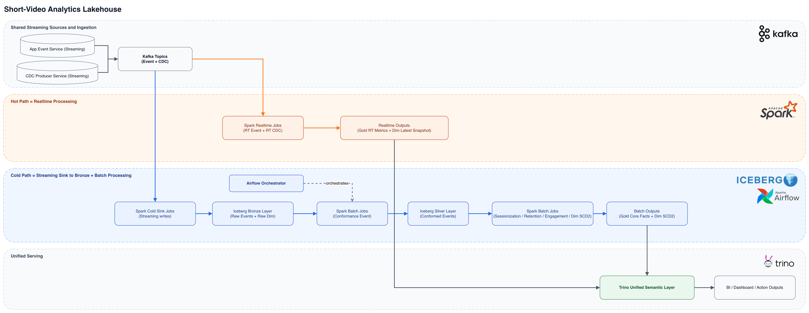

# Short Video Analytics Lakehouse


Short Video Analytics Lakehouse is a contract-driven analytics platform for short-video operations. It combines realtime decision previewing with daily batch analytics on a governed lakehouse stack built with Kafka, Spark, Iceberg, Trino, dbt, and Airflow.

> [!IMPORTANT]
> Read my detailed design decisions for this project:
> [Short Video Analytics: Closing the Gap Between Signals and Truth](https://medium.com/@0429shen/short-video-analytics-closing-the-gap-between-signals-and-truth-2d11005344b6)

## Overview

The platform is designed to support two operational needs in one system:

1. Realtime decision support for content operations (`BOOST`, `REVIEW`, `RESCUE`).
2. Daily analytics products for retention, engagement, and session behavior.

Core delivery path:

- Realtime: `Kafka -> Spark Structured Streaming -> Iceberg -> Trino semantic serving -> dashboard preview`
- Batch: `Iceberg bronze -> Spark batch jobs -> dbt quality gates -> semantic serving outputs`

## Architecture



High-level processing model:

```text
content_events + cdc.videos
  -> Kafka contracts
  -> Spark (streaming + batch)
  -> Iceberg tables (bronze / dims / gold)
  -> Trino semantic layer
  -> BI and operational decision preview
```

## Local Runbook

Prerequisites:

- Docker + Docker Compose
- Python 3.10+
- GNU Make

Set up the Python environment:

```bash
python3 -m venv .venv
.venv/bin/pip install -r requirements.txt
```

Run the full local bootstrap in one command:

```bash
make up
```

`make up` is the local entrypoint. It:

- Tears down existing containers and named volumes.
- Rebuilds the core pipeline stack in dependency order.
- Starts `minio`, `catalog-postgres`, `zookeeper`, `kafka`, `iceberg-rest`, and `spark`.
- Bootstraps Iceberg namespaces and tables.
- Creates Kafka topics if they do not already exist.
- Starts the three realtime Spark jobs in the `spark` container.
- Runs the bounded generator into Kafka.
- Waits for the jobs to drain and verifies bronze parquet files in MinIO.

Start serving and UI services only when needed:

```bash
docker compose up -d trino airflow metabase grafana
```

Local service endpoints:

- MinIO: `http://localhost:9001`
- Iceberg REST: `http://localhost:8181`
- Kafka: `localhost:9092`
- Spark UI: `http://localhost:9090`
- Trino: `http://localhost:8081`
- Airflow: `http://localhost:8082`
- Metabase: `http://localhost:3001`
- Grafana: `http://localhost:3000`

Default local credentials:

- MinIO: `admin` / `password`
- Airflow: `admin` / `admin`

Stop and clean all local containers and named volumes:

```bash
make down
```

If Spark dependency state is corrupted, force a clean jar download:

```bash
make clean
```

## Validation

If you have not created the Python environment yet:

```bash
python3 -m venv .venv
.venv/bin/pip install -r requirements.txt
```

Run unit/integration tests:

```bash
.venv/bin/python -m pytest
```

Run full acceptance flow (reset + seed + six acceptance scripts):

```bash
make integration-test
```

Acceptance scripts are under `src/scripts/` and verify realtime and batch contract surfaces end to end.

## Documentation

For full architecture, contracts, and scope boundaries:

1. [Documentation Overview](docs/README.md)
2. [Current Scope](docs/milestone/current-scope.md)
3. [Future Plan](docs/milestone/future-plan.md)
4. [Realtime Decisioning Contracts](docs/architecture/realtime-decisioning/README.md)
5. [Streaming Contract](docs/architecture/streaming/spark-realtime-jobs-contract.md)
6. [Data Model Contract](docs/architecture/data-model/data-model-contract.md)
7. [Serving Contract](docs/architecture/serving/trino-realtime-semantic-serving-contract.md)
8. [Batch Analytics Contracts](docs/architecture/batch-analytics/README.md)

## For Contributors

- Treat `docs/` contracts as the source of truth before changing behavior.
- Keep changes scoped to one contract surface when possible.
- Before opening a PR, create `.venv`, install dependencies, and run `pytest`.
- For Spark job or acceptance-script changes, run `make integration-test`.
