---

# Design Doc : Pipeline Architecture & Data Flow

## 1. Architecture Overview

### 1.1 Objective

Build a high-throughput, low-latency **Hybrid (Lambda) Architecture** Lakehouse. The pipeline ingests raw user interaction events, processes them in real-time for operational monitoring (The "Pulse"), and simultaneously archives raw history for strategic analysis (The "Diagnosis"), serving both needs from a unified **Apache Iceberg** storage layer.

**1.2 Core Design Principles**
* **SLA-Driven Engineering:**
* **Latency SLA:** **P95 < 3 Minutes** for Real-time Operational Metrics. (Derived from: 1m Window + 10s Watermark + Iceberg Commit Time).
* **Availability SLA:** Ensure T+1 Batch Datasets are ready by **09:00 AM daily** for strategic reporting.

* **Hybrid Lakehouse Strategy (Polyglot Persistence):**
* **Real-time Mart (Gold RT):** Use **Append-Only** pattern with Tumbling Windows for low-latency operational metrics ("The Pulse").
* **Strategic Mart (Gold Batch):** Re-computed daily from Silver facts for high-precision, fully enriched metrics ("The Diagnosis").
* **Mutable Metadata (Dims):** Use **Merge-on-Read (MoR)** pattern to guarantee strict consistency for slowly changing dimensions (SCD).

* **Decoupled Compute & Storage:** Use **Trino** as the serving layer to query **Iceberg** tables directly.
* **Schema Resilience:** Implement a "Header + Body" pattern to handle upstream schema drift.

---

## 2. High-Level Data Flow Diagram

```mermaid
graph LR
  %% ==================== Styles ====================
  classDef source   fill:#e1f5fe, stroke:#01579b, stroke-width:2px, color:#000000
  classDef stream   fill:#fff3e0, stroke:#ff6f00, stroke-width:2px, color:#000000
  classDef batch    fill:#f3e5f5, stroke:#7b1fa2, stroke-width:2px, stroke-dasharray:5 5, color:#000000
  classDef storage  fill:#fff9c4, stroke:#fbc02d, stroke-width:2px, color:#000000
  classDef serving  fill:#e8f5e9, stroke:#2e7d32, stroke-width:2px, color:#000000
  classDef ops      fill:#eceff1, stroke:#455a64, stroke-width:2px, stroke-dasharray:3 3, color:#000000

  %% ==================== 1) Sources ====================
  subgraph S["1) Sources"]
    direction TB
    EventGen[("App / Web Events<br/>(Python Generator)")]:::source
    CDCGen[("DB Changes<br/>(CDC Generator)")]:::source
  end

  %% ==================== 2) Messaging ====================
  subgraph M["2) Kafka (Messaging Bus)"]
    direction TB
    KafkaEvents["Kafka Topic: events"]:::source
    KafkaCDC["Kafka Topic: cdc"]:::source
  end

  %% ==================== 3) Stream Processing (Hot Path) ====================
  subgraph R["3) Stream Processing (Hot Path)"]
    direction TB
    SparkEvents["Spark Structured Streaming<br/>consume events"]:::stream
    SparkCDC["Spark Structured Streaming<br/>consume cdc"]:::stream
  end

  %% ==================== 4) Lakehouse (Storage) ====================
  subgraph L["4) Iceberg Lakehouse (Tables)"]
    direction TB
    Bronze["Bronze: raw append-only"]:::storage
    Silver["Silver: cleaned + standardized"]:::storage
    Dims["Dims: SCD Type 2"]:::storage
    GoldRT["Gold-RT: near real-time metrics"]:::storage
    GoldBatch["Gold-Batch: batch mart"]:::storage
  end

  %% ==================== 5) Batch / Maintenance (Cold + Ops) ====================
  subgraph B["5) Batch & Maintenance (Cold Path / Ops)"]
    direction TB
    EnrichJob["Batch: enrich Bronze → Silver"]:::batch
    AggJob["Batch: aggregate Silver ⨝ Dims → Gold-Batch"]:::batch
    CompactJob["Ops: Iceberg OPTIMIZE / compaction"]:::ops
  end

  %% ==================== 6) Serving ====================
  subgraph V["6) Serving"]
    direction TB
    Trino["Trino / PrestoSQL<br/>(Compute Engine)"]:::serving
    Views["Semantic Views<br/>(Read-Time Joins)"]:::serving
    Metabase["Metabase<br/>(BI / Self-Serve)"]:::serving
    Grafana["Grafana<br/>(System / Query Metrics)"]:::serving
  end

  %% ==================== Flows ====================

  %% Sources -> Kafka
  EventGen --> KafkaEvents
  CDCGen --> KafkaCDC

  %% Kafka -> Streaming
  KafkaEvents ==> SparkEvents
  KafkaCDC ==> SparkCDC

  %% Hot Path writes
  SparkEvents -->|append| Bronze
  SparkEvents -->|window agg| GoldRT
  SparkCDC -->|merge/upsert| Dims

  %% Cold Path (batch) reads/writes
  Bronze -.->|read| EnrichJob
  EnrichJob -.->|write| Silver
  Silver -.->|read| AggJob
  Dims -.->|join| AggJob
  AggJob  -.->|write| GoldBatch

  %% Maintenance (Ops)
  CompactJob -.->|OPTIMIZE| Bronze
  CompactJob -.->|OPTIMIZE| Dims
  CompactJob -.->|OPTIMIZE| GoldRT

  %% Serving
  GoldRT --> Trino
  GoldBatch --> Trino
  Dims --> Trino
  
  Trino --> Views
  Views --> Metabase
  Trino --> Grafana

  %% ==================== Link Styling ====================
  %% Hot Path (orange): 0-7 (sources->kafka, kafka->spark, spark->tables)
  linkStyle 0,1,2,3,4,5,6 stroke:#ff5722,stroke-width:3px

  %% Cold Path (purple dashed): 7-12 (bronze->enrich->silver->agg->goldbatch + join)
  linkStyle 7,8,9,10,11 stroke:#7b1fa2,stroke-width:2px,stroke-dasharray:5 5

  %% Ops (gray dashed): optimize edges (after cold path)
```

---

## 3. Component Design Details

### 3.1 Source & Ingestion Layer

* **Component:** Python Event Generator & Apache Kafka.
* **Topic:** `content_events`
* **Partition Strategy:** Partition by `video_id`.
* **Rationale:** The Real-time Dashboard is **Content-Centric** (Viral Velocity). Partitioning by `video_id` ensures all interactions (likes, shares) for a specific video land in the same Kafka partition, minimizing Shuffle overhead.

### 3.2 Stream Processing Layer (The Core)**
* **Engine:** Apache Spark Structured Streaming.
* **Stream A (Bronze - Raw):**
* **Pattern:** Append-Only.
* **Logic:** Ingests raw events with "Header + Body" schema preservation.

* **Stream B (Gold - Metrics):**
* **Pattern:** **Tumbling Window Aggregation (Append-Only)**.
* **Window Size:** **1 Minute** (Event Time).
* **Watermark:** **10 Seconds** (to handle late data while maintaining low latency).
* **Trigger Interval:** **1 Minute** (Processing Time).
* **Logic:** Aggregates metrics (`likes`, `impressions`, `completions`) per video per minute.
* **Storage Target:** `lakehouse.gold.rt_video_stats_1min`.
* **Advantage:** Eliminates the "Small File Problem" and "Read Amplification" associated with high-frequency Upserts.

### 3.3 Dimension Management (CDC Streaming Ingestion)

* **Objective:** Ensure metadata (e.g., Video Category, User Risk Profile) is available for joining with real-time metrics with **< 5 minute latency**, supporting the "Read-time Join" pattern in Trino.
* **Workflow:**
1. **Source (CDC Stream):**
* A Python Generator simulates database changes (Create/Update/Delete) and pushes them to a separate Kafka Topic: `content_cdc`.
* *Payload:* `{ "op": "u", "ts_ms": 170000..., "before": null, "after": { "video_id": "v_1023", "category": "Beauty", "status": "active" } }` (Topic: `cdc.content.videos`)

2. **Ingestion (Spark Structured Streaming):**
* A separate Spark Streaming job reads `content_cdc`.
* **Trigger:** ProcessingTime = `5 minutes` (Micro-batch).
* **Logic:** Deduplicates updates within the batch (keeping the latest `op` per ID) to minimize Merge overhead.

3. **Storage (Iceberg MERGE):**
* Performs `MERGE INTO lakehouse.dims.dim_videos` inserts new versions (SCD Type 2) based on business logic.
* **Why Micro-batch?** Iceberg supports streaming writes, but `MERGE` operations are expensive. Batching updates every 5 minutes balances data freshness with write efficiency (avoiding the "Small File Problem").

### 3.4 Serving Layer

* **Engine:** Trino (PrestoSQL).
* **View Strategy (Read-Side Sliding Window):**
* Since Real-time Gold data is stored as 1-minute buckets, Trino Views are used to calculate the final "Viral Velocity".
* *Logic:* `SELECT sum(likes) FROM gold.rt_video_stats_1min WHERE window_start >= now() - interval '10' minute`.

* **Clients:**
* **Metabase:** Queries Gold Views for "Viral Trends" and Dims for "Creator Segments".
* **Grafana:** Queries System Metrics.

### 3.5 Maintenance Layer: Compaction Strategy (Airflow + Spark Batch)

* **Objective:** Solve the "Small File Problem" inherent to streaming ingestion (where 10s triggers create tiny files) and optimize read performance for Trino by reducing metadata overhead.
* **Schedule:** Triggered **Hourly (every 60 minutes)** via Airflow.
* **Strategy by Table Type:**
1. **Bronze & Gold RT (Append-Only):**
* **Action:** **Bin-packing**.
* **Logic:** The Spark job identifies small Parquet files created in the last hour and rewrites them into larger, optimal-sized files (Target: ~128MB) using ZSTD compression.

2. **Dims (Merge-on-Read / Upsert):**
* **Action:** **Major Compaction (Rewrite Data Files)**.
* **Logic:** Streaming `MERGE` operations create "Delete Files" (tombstones) rather than rewriting data immediately. Over time, this increases read latency (Read Amplification). This job forces a rewrite of data files to physically apply deletes and updates, resetting the read performance.

* **Exclusions:**
* **Silver & Gold Batch:** Explicit compaction is **excluded**. The Daily Spark Batch jobs are configured to write optimized file sizes directly (e.g., using `write.distribution-mode=hash`), making post-processing redundant.

* **Snapshot Management:**
* **Expire Snapshots:** The job also runs `expire_snapshots` to remove historical versions older than 7 days, preventing metadata bloat and freeing up physical storage on MinIO.

---

## 4. Engineering Trade-offs & Decisions

### 4.1 Architecture Pattern: Hybrid (Lambda)

* **Decision:** **Hybrid Architecture (Lambda)**.
* **Trade-off:**
* *Pros:* Combines the low latency of **Kappa** (for Ops) with the data completeness and complex join capabilities of **Batch** (for Strategy).
* *Cons:* Requires maintaining two processing paths (Streaming & Batch).
* *Justification:* While Streaming provides the "Pulse", the "Diagnosis" (Strategic Dashboard) requires complex **Fact-Dimension Joins** and sessionization that are more cost-effective and accurate in Batch (Silver -> Gold).

### 4.2 Sessionization Strategy

* **Decision:** Moved Sessionization to **Batch Layer (T+1)**.
* **Trade-off:**
* We sacrificed *Real-time Session Metrics* (not critical for Content Ops).
* We gained **Resource Efficiency** (saved ~40% RAM by avoiding State Store) and **Accuracy** (better handling of late-arriving events).

### 4.3 Latency vs. Throughput (SLA Definition)

* **Decision:** Relaxed Real-time SLA to **~3 Minutes**.
* **Trade-off:**
* *Pros:* Significantly improved storage health (fewer small files) and pipeline stability.
* *Cons:* Ops dashboard has a 3-minute lag compared to raw events.
* *Justification:* Viral trends evolve over 15-30 minute windows; sub-minute latency is not required for the specific business action (boosting/banning), making this a worthwhile trade-off for system robustness.

### 4.4 Hybrid Write Patterns (Append vs. Upsert)**
* **Decision:** We apply different write patterns based on data characteristics.
* **Gold Layer (Real-time):** Uses **Append-Only**. High-frequency metric updates (e.g., 10k likes/sec) would choke an Upsert pipeline with small files and delete vectors. Appending pre-aggregated buckets creates clean, large Parquet files.
* **Dimension Layer (Metadata):** Uses **Merge-on-Read (Upsert)**. User/Video profile changes are low volume but require strict consistency. The cost of MoR is justified here for data accuracy.
---

## 5. Infrastructure Stack (Docker)

| Service | Container Name | Port | Role |
| --- | --- | --- | --- |
| **Kafka** | `kafka` | 9092 | Event message bus. |
| **Spark** | `spark-master` | 7077 | Stream processing & Batch Jobs. |
| **Trino** | `trino` | 8080 | Distributed SQL query engine. |
| **MinIO** | `minio` | 9000 | Object storage (S3). |
| **Metabase** | `metabase` | 3030 | BI Dashboard (JDBC Client). |
| **Airflow** | `airflow-webserver` | 8081 | Workflow Orchestration. |
| **Spark** | Spark UI | 4040 | Application monitoring and debugging |
| **Spark** | Thrift Server (optional) | 10000 | SQL access for BI tools |

---