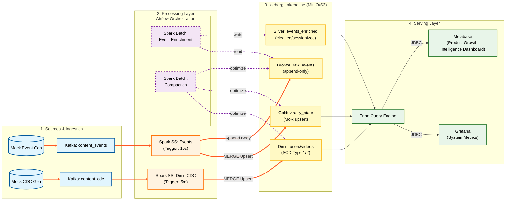

---

# Design Doc : Pipeline Architecture & Data Flow

## 1. Architecture Overview

### 1.1 Objective

Build a high-throughput, low-latency **Kappa Architecture** Lakehouse. The pipeline ingests raw user interaction events, processes them in real-time for operational monitoring (The "Pulse"), and simultaneously archives raw history for strategic analysis (The "Diagnosis"), serving both needs from a unified **Apache Iceberg** storage layer.

### 1.2 Core Design Principles

* **SLA-Driven Engineering:**
* **Latency SLA:** Guarantee **< 60 seconds** data freshness for the Real-time Operational Dashboard.
* **Availability SLA:** Ensure T+1 Batch Datasets are ready by **09:00 AM daily** for strategic reporting.

* **Lambda-Free:** Use a single processing code path (Spark Structured Streaming) for both real-time ingestion and historical replay to guarantee metric consistency.
* **Decoupled Compute & Storage:** Use **Trino** as the serving layer to query **Iceberg** tables directly, avoiding data copying.
* **Schema Resilience:** Implement a "Header + Body" pattern to handle upstream schema drift without pipeline failure.

---

## 2. High-Level Data Flow Diagram

---

## 3. Component Design Details

### 3.1 Source & Ingestion Layer

* **Component:** Python Event Generator & Apache Kafka.
* **Topic:** `content_events`
* **Partition Strategy:** Partition by `video_id`.
* **Rationale:** The Real-time Dashboard is **Content-Centric** (Viral Velocity). Partitioning by `video_id` ensures all interactions (likes, shares) for a specific video land in the same Kafka partition, minimizing Shuffle overhead.

### 3.2 Stream Processing Layer (The Core)

* **Engine:** Apache Spark Structured Streaming (Micro-batch Mode).
* **Trigger Interval:** 10-30 seconds.
* **Logic:** The `foreachBatch` pattern is used to split the stream into two write paths:
* **Stream A (Bronze):** Append-only raw logs with "Header + Body" schema for full fidelity.
* **Stream B (Gold):** Stateful Upsert (`MERGE INTO`) to maintain the real-time "Viral Score" of videos.

### 3.3 Dimension Management (CDC Streaming Ingestion)

* **Objective:** Ensure metadata (e.g., Video Category, User Risk Profile) is available for joining with real-time metrics with **< 5 minute latency**, supporting the "Read-time Join" pattern in Trino.
* **Workflow:**
1. **Source (CDC Stream):**
* A Python Generator simulates database changes (Create/Update/Delete) and pushes them to a separate Kafka Topic: `content_cdc`.
* *Payload:* `{ "op": "u", "ts_ms": 170000..., "before": null, "after": { "video_id": "v_1023", "category": "Beauty", "status": "active" } }`

2. **Ingestion (Spark Structured Streaming):**
* A separate Spark Streaming job reads `content_cdc`.
* **Trigger:** ProcessingTime = `5 minutes` (Micro-batch).
* **Logic:** Deduplicates updates within the batch (keeping the latest `op` per ID) to minimize Merge overhead.

3. **Storage (Iceberg MERGE):**
* Performs `MERGE INTO lakehouse.dims.dim_videos` inserts new versions (SCD Type 2) based on business logic.
* **Why Micro-batch?** Iceberg supports streaming writes, but `MERGE` operations are expensive. Batching updates every 5 minutes balances data freshness with write efficiency (avoiding the "Small File Problem").

### 3.4 Serving Layer

* **Engine:** Trino (PrestoSQL).
* **Connection:** **JDBC (Java Database Connectivity)**.
* *Note:* JDBC acts as the standard bridge allowing Metabase to send SQL queries to Trino and retrieve result sets for visualization.

* **Clients:**
* **Metabase:** Queries Gold + Dims for Business Ops.
* **Grafana:** Queries System Metrics (Lag, Latency).

### 3.5 Maintenance Layer: Compaction Strategy (Airflow + Spark Batch)

* **Objective:** Solve the "Small File Problem" inherent to streaming ingestion (where 10s triggers create tiny files) and optimize read performance for Trino by reducing metadata overhead.
* **Schedule:** Triggered **Hourly (every 60 minutes)** via Airflow.
* **Strategy by Table Type:**
1. **Bronze (Append-Only):**
* **Action:** **Bin-packing**.
* **Logic:** The Spark job identifies small Parquet files created in the last hour and rewrites them into larger, optimal-sized files (Target: ~128MB) using ZSTD compression.

2. **Gold & Dims (Merge-on-Read):**
* **Action:** **Major Compaction (Rewrite Data Files)**.
* **Logic:** Streaming `MERGE` operations create "Delete Files" (tombstones) rather than rewriting data immediately. Over time, this increases read latency (Read Amplification). This job forces a rewrite of data files to physically apply deletes and updates, resetting the read performance.

* **Snapshot Management:**
* **Expire Snapshots:** The job also runs `expire_snapshots` to remove historical versions older than 7 days, preventing metadata bloat and freeing up physical storage on MinIO.

---

## 4. Engineering Trade-offs & Decisions

### 4.1 Kappa vs. Lambda Architecture

* **Decision:** **Kappa Architecture**.
* **Trade-off:**
* *Pros:* Single codebase (Spark SS) ensures metric consistency between Real-time and Replay.
* *Cons:* Historical replay can be slower than dedicated batch engines.
* *Mitigation:* Heavy historical analysis (Retention) is offloaded to the **Silver Layer** (Batch) which is optimized via daily compaction.

### 4.2 Sessionization Strategy

* **Decision:** Moved Sessionization to **Batch Layer (T+1)**.
* **Trade-off:**
* We sacrificed *Real-time Session Metrics* (not critical for Content Ops).
* We gained **Resource Efficiency** (saved ~40% RAM by avoiding State Store) and **Accuracy** (better handling of late-arriving events).

### 4.3 SLA Definition

* **Real-time (Gold):** < 1 min latency. Achieved via Spark Streaming Micro-batches + Iceberg Merge-on-Read.
* **Batch (Silver/Dims):** T+1 Availability. Achieved via Airflow scheduling to ensure data consistency for morning reports.

---

## 5. Infrastructure Stack (Docker)

| Service | Container Name | Port | Role |
| --- | --- | --- | --- |
| **Kafka** | `kafka` | 9092 | Event message bus. |
| **Spark** | `spark-master` | 7077 | Stream processing & Batch Jobs. |
| **Trino** | `trino` | 8080 | Distributed SQL query engine. |
| **MinIO** | `minio` | 9000 | Object storage (S3). |
| **Metabase** | `metabase` | 3030 | BI Dashboard (JDBC Client). |
| **Airflow** | `airflow-webserver` | 8081 | Workflow Orchestration. |
| **Spark** | Spark UI | 4040 | Application monitoring and debugging |
| **Spark** | Thrift Server (optional) | 10000 | SQL access for BI tools |
